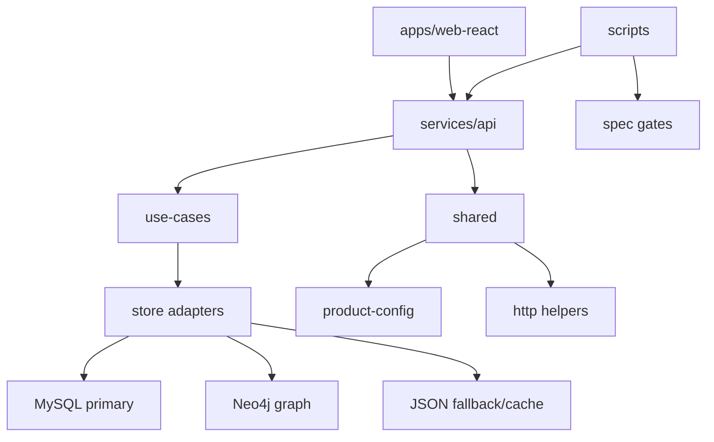

# Track 3：系统层面代码重构升级

## 背景与目标

Auto Info 目前采用两层运行：`apps/web-react` 前端与 `services/api` Node 后端。随着日报、分析、阅读助手、科技雷达等能力增长，系统中开始出现可复用能力：来源抓取、报告渲染、时间线、历史记录、配置读取、质量门禁、JSON fallback。Track 3 的目标是在不改变产品边界的前提下升级系统结构，降低重复代码与隐式耦合。

## 当前问题

- API 侧多个 UC 都有“读取存储、构建报告、质量过滤、历史写入”的相似流程。
- 前端页面内仍有部分历史列表、资料列表、时间线、来源跳转逻辑分散实现。
- MySQL/Neo4j/JSON fallback 的边界需要更明确，避免本地 JSON 被误认为主存。
- 测试脚本覆盖面已较完整，但新增行为时仍依赖人工记忆更新 verify/features。
- 部分架构文档仍描述未来异步任务中心，与当前本地 Node 实现需要区分“当前态/目标态”。

## 范围内

后端：

- `services/api/src/shared/*`
- `services/api/src/use-cases/*`
- `server.mjs`

前端：

- `apps/web-react/src/lib/*`
- `apps/web-react/src/components/report/*`
- `apps/web-react/src/components/*`
- `apps/web-react/src/pages/*`

测试与运行：

- `scripts/verify.mjs`
- `scripts/test-features.mjs`
- `scripts/test-*.mjs`
- `scripts/audit-structure.mjs`

文档与约束：

- `docs/architecture/SYSTEM_DESIGN.md`
- `spec/constraints/DIRECTORY-STRUCTURE.md`
- `spec/constraints/DATA-STORAGE.md`
- `spec/constraints/CODING-STANDARDS.md`
- `spec/constraints/RUN-VERIFICATION.md`

## 范围外

- 不新增第二套后端。
- 不引入并行前端实现。
- 不把未来 Celery/Redis 任务中心作为当前必须落地项，除非 Product 明确发起。
- 不为未确定的产品形态提前抽象复杂框架。

## 目标架构

原则：

- `services/api` 是唯一后端。
- `apps/web-react` 是唯一前端。
- `spec/` 是规格 SSOT。
- `data/` 是本地降级/缓存，不是产品契约。

## 重构路线

### Phase 1：API 基础能力收敛

目标：

- 统一错误响应与 warnings 表达。
- 收敛 URL/媒体/PDF 抓取逻辑。
- 抽取质量门禁与弱文案过滤的共享边界。
- 明确每个 UC 的 store 读写入口。

候选改动：

- `services/api/src/shared/http.mjs`：统一错误格式与状态码辅助。
- `services/api/src/shared/store.mjs`：明确 JSON fallback 的读写语义。
- `uc-003-reading-assistant/source-fetch.mjs`：作为来源抓取基础能力，避免其他 UC 私自抓取。
- `uc-001-daily-events/event-display.mjs` 与 `event-decision-copy.mjs`：保留日报专属文案逻辑，不随意外溢到阅读助手。

### Phase 2：前端共用组件收敛

目标：

- 报告、来源、时间线、历史列表形成稳定组件族。
- 页面只编排业务状态，不重复写展示细节。

候选组件：

- `components/report/ReportSection.tsx`
- `components/report/EventTimeline.tsx`
- `components/report/SourceJumpLink.tsx`
- 新增候选：`components/report/SourceList.tsx`
- 新增候选：`components/report/HistoryList.tsx`

约束：

- 抽象必须来自至少两个实际调用点。
- 不为单页面预先抽象。
- 组件不直接调用业务 API；API 调用放在 page 或 `lib/`。

### Phase 3：数据层边界明确

目标：

- 标注 MySQL 为结构化主存。
- Neo4j 为关系图谱主存，可降级到内存图算法。
- JSON 仅为本地开发降级、缓存或迁移辅助。

文档更新：

- `spec/constraints/DATA-STORAGE.md`
- `docs/architecture/SYSTEM_DESIGN.md`

验收：

- 代码路径能从 store 模块看出主存/fallback。
- 不在页面或 use-case 中直接散落读写 data 文件。

### Phase 4：测试与交付门禁自动化

目标：

- 新 API 自动纳入 verify。
- 新行为自动纳入 feature tests。
- 目录/重复实现通过 audit 约束。

候选改动：

- `scripts/verify.mjs`：基础接口与健康检查。
- `scripts/test-features.mjs`：跨 UC 主路径。
- `scripts/test-*.mjs`：纯函数与边界条件。
- `scripts/audit-structure.mjs`：目录与唯一实现审查。

## 升级优先级

| 优先级 | 项目 | 原因 |
|---|---|---|
| P0 | 不破坏现有门禁 | `npm test` 与双端在线是交付基础 |
| P1 | API 错误与来源抓取统一 | 直接影响阅读助手、日报、科技雷达质量 |
| P1 | 前端报告/时间线/来源组件复用 | 已有多个调用点，收益明确 |
| P2 | 数据层主存/fallback 文档与代码边界 | 降低后续迁移风险 |
| P2 | 历史列表组件复用 | 可提升一致性，但不应阻塞主路径 |
| P3 | 异步任务中心 | 当前文档中是目标态，需单独 Product 发起 |

## 风险与回滚

风险：

- 共享模块抽象过度，导致 UC 特有逻辑难以表达。
- Store 层调整可能影响本地 JSON 历史数据。
- 错误格式统一可能影响前端既有错误展示。
- 测试脚本加强可能暴露历史脏数据，需要修复数据或调整测试夹具。

回滚：

- 每个 Phase 独立执行，避免跨层一次性替换。
- 保留旧函数到调用点全部迁移完成。
- 数据结构变更先做读取兼容，再写入新结构。
- 若测试失败，优先回滚共享层改动，不回滚业务数据。

## 验收标准

- 目录结构符合 `spec/constraints/DIRECTORY-STRUCTURE.md`。
- 无重复前端/后端实现。
- API 变更已更新 `spec/contracts/`。
- 行为变更已更新 `scripts/test-features.mjs` 或对应单测。
- `npm run audit`、`npm test` 通过。
- `npm run restart:clean` 后 `4173` / `5174` 双端在线。

## 执行记录模板

| Phase | 范围 | 规格更新 | 实现更新 | 测试 | 状态 |
|---|---|---|---|---|---|
| Phase 1 | API 基础能力 | 待执行 | 待执行 | 待执行 | planned |
| Phase 2 | 前端共用组件 | 待执行 | 待执行 | 待执行 | planned |
| Phase 3 | 数据层边界 | 待执行 | 待执行 | 待执行 | planned |
| Phase 4 | 测试与门禁 | 待执行 | 待执行 | 待执行 | planned |

## 审查记录

| 阶段 | 结论 | 说明 |
|---|---|---|
| Product 发起 | 待执行 | 本文档为 Track 3 方案草案 |
| Design 审查 | 按需 | 若涉及 UI 组件行为则执行 |
| Quality 验证 | 待执行 | audit/test/restart/双端在线 |
| Product 验收 | 待执行 | 按系统稳定性、可维护性与运行门禁验收 |
