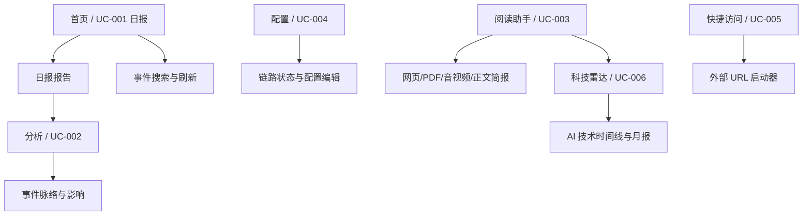

# Track 2：产品功能重构合并或拆分

## 背景与目标

Auto Info 的功能已从“日报 + 分析 + 阅读”扩展到科技雷达、快捷访问、系统配置。多个能力开始共享类似结构：时间线、报告体、历史记录、来源链接、外部抓取、摘要质量门禁。Track 2 的目标是先从产品角度明确哪些能力应该合并，哪些必须拆分，避免 UI 与系统重构时边界不清。

## 当前问题

- 日报时间线与科技雷达时间线有相似展示，但数据周期和业务含义不同。
- 阅读助手同时支持网页、PDF、音视频、正文、文件，输入统一但来源类型与失败语义需要保持清晰。
- 分析页包含查询、历史、图层、时间刷选、事件明细，主路径和辅助路径容易混杂。
- 配置页既是运行状态页也是编辑页，需要避免成为“功能入口集合”。
- 快捷访问是启动器，不应与阅读助手或 iframe 预览混淆。

## 范围内

- `spec/requirements/REQUIREMENTS.md`
- `spec/use-cases/UC-001-daily-major-events.md`
- `spec/use-cases/UC-002-event-tag-analysis.md`
- `spec/use-cases/UC-003-reading-assistant.md`
- `spec/use-cases/UC-004-system-config.md`
- `spec/use-cases/UC-005-quick-access.md`
- `spec/use-cases/UC-006-ai-tech-radar.md`
- `spec/contracts/API-uc-*.md`
- `scripts/test-features.mjs`

## 范围外

- 不在本 Track 内做大规模代码抽象；只定义边界与契约。
- 不决定视觉细节；视觉与交互归 Track 1。
- 不更改存储实现；存储与系统升级归 Track 3。

## 功能地图

## 合并/拆分决策

| 主题 | 决策 | 原因 | 影响 |
|---|---|---|---|
| 日报时间线 / 科技雷达时间线 | 展示组件可合并，业务模型拆分 | 都是 timeline + Card，但日报按事件发生时间，科技雷达按日/周/月/年周期 | 共用前端基础组件，不共用 API 数据结构 |
| 阅读助手多来源输入 | 输入合并，来源类型拆分 | 用户只需要一个输入框；系统必须区分 web/pdf/video/audio/text/file 的失败提示 | `sourceType`、`sources` 保持显式字段 |
| 阅读助手与科技雷达 | 简报能力复用，产品入口拆分 | 科技雷达可跳转阅读简报，但不替代阅读助手 | 保留 `briefingSessionId` 深链 |
| 日报与分析 | 事件数据关联，任务拆分 | 日报是消费报告，分析是主动查询和关系推理 | 日报可引导分析，不在日报页内嵌完整分析 |
| 配置与链路状态 | 同页合并，入口拆分 | 配置编辑与链路诊断强相关，但不是业务主路径 | 配置页保持独立 Tab |
| 快捷访问与阅读助手 | 拆分 | 快捷访问只负责打开 URL，不抽取正文 | 禁止 iframe 预览，不复用阅读摘要逻辑 |

## UC 边界

### UC-001 日报

职责：

- 生成/查看每日重大事件报告。
- 组织概要、时间线、正文块、参考资料。
- 维护关注类别和日报归档。

不负责：

- 深度事件关系图谱。
- 外部资料全文摘要。
- AI 技术趋势归档。

### UC-002 分析

职责：

- 按主题/标签构建事件脉络、影响关系、地区/领域分层。
- 支持历史分析恢复、更新事件、时间刷选。

不负责：

- 生成每日新闻报告。
- 替代科技雷达归档。

### UC-003 阅读助手

职责：

- 接收网页、PDF、音视频链接、正文、文件。
- 抽取文本或接收字幕/转写，生成中文简报。
- 保存阅读历史与 LRU 回填。

不负责：

- 自动转写音视频二进制内容。
- 做事件图谱分析。

### UC-004 系统配置

职责：

- 配置与查看 MySQL、Neo4j、Google Search、LLM、Jina Reader 等链路。
- 展示当前是否处于本地 JSON 降级。

不负责：

- 执行业务摘要或图谱查询。

### UC-005 快捷访问

职责：

- 管理常用 URL。
- 点击目录后用浏览器打开原始 URL。

不负责：

- iframe 预览。
- 抽取网页正文。

### UC-006 科技雷达

职责：

- 展示 AI 技术动态、热词、论文、大厂平台来源。
- 按日/周/月/年组织时间线。
- 月报与阅读助手简报可关联。

不负责：

- 每日全球事件全量报告。
- 非 AI 技术主题归档。

## API 契约影响

所有行为变化必须先改 `spec/contracts/API-*.md`：

- 新字段必须显式写入请求/响应示例。
- 前端不得依赖隐式 fallback 字段。
- 失败原因必须结构化、可读，并覆盖到 feature test。
- 历史列表项必须保持最小稳定字段：`id/sessionId`、`title`、`updatedAt`、`summaryPreview`。

## 测试口径

必须覆盖：

- UC-001 日报生成、更新、归档、时间线与概要质量。
- UC-002 分析查询、历史、图谱关系。
- UC-003 网页/PDF/音视频/正文输入、低信号拒绝、历史 LRU。
- UC-004 配置读写、链路状态。
- UC-005 快捷访问 URL 管理。
- UC-006 科技雷达 feed、时间线、月报修复。

测试落点：

- `scripts/test-features.mjs`
- 关键纯函数单测：`scripts/test-*.mjs`
- `scripts/verify.mjs` 覆盖基础接口可用性。

## 风险与回滚

风险：

- 合并输入入口可能让错误提示变得笼统。
- 拆分功能边界可能影响历史用户对入口的记忆。
- API 字段调整可能破坏前端旧读取逻辑。

回滚：

- 契约变更先保留兼容字段，待前端切换后再清理。
- 每个 UC 单独验收，不跨 UC 批量删除旧行为。
- 失败时优先回滚页面入口和契约变更，保留数据。

## 验收标准

- 每个 UC 有唯一主入口、明确输入输出和失败语义。
- 合并的是用户输入/展示模式，拆分的是业务责任和数据契约。
- `spec/requirements/REQUIREMENTS.md` 与各 UC 描述一致。
- `scripts/test-features.mjs` 覆盖新增或调整行为。
- Product 验收确认：功能完备、流程顺畅、无重复入口。

## 审查记录

| 阶段 | 结论 | 说明 |
|---|---|---|
| Product 发起 | 已执行 | 2026-06-04 启动 Track 2 边界核查 |
| Design 审查 | 按需 | 本轮为 spec/契约层收敛，未涉及 UI 入口变更 |
| Quality 验证 | 部分通过 | 修 REQ-F-005 规格冲突、补 API-uc-005 契约；audit/verify 通过。信号质量加权需真实数据验证，待本机 |
| Product 验收 | 部分通过 | 6 UC 契约完整、规格自洽；边界决策代码多已落地 |

> 执行记录：agent-hub/reports/auto-info/refactor/关于auto-info-track23SpecCleanupExecution.md
