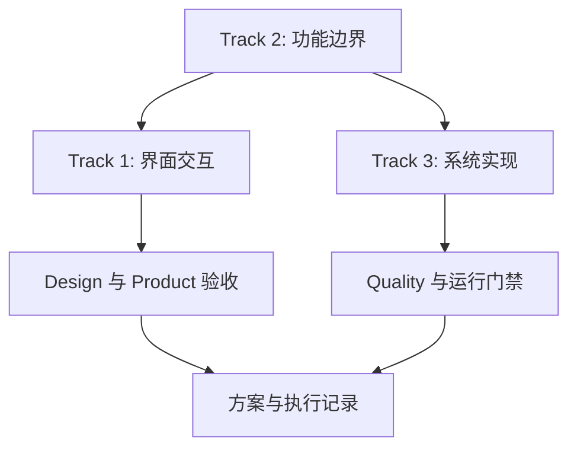

# 三段重构方案

## 背景

当前 Auto Info 已形成六条主要用例：今日日报、事件分析、阅读助手、系统配置、快捷访问、科技雷达。近期迭代同时触及界面、功能边界与系统实现，若继续混合推进，容易出现 UI 先行但功能边界未定、代码复用过早抽象、验收口径不一致等问题。

本方案将后续重构拆为三段独立任务：

1. 产品设计：界面与交互重构
2. 产品设计：功能合并、拆分与边界重构
3. 系统层面：代码、数据、测试与运行架构升级

三段任务共享 STDD 流程：先更新 `spec/`，再改实现；每段均需 Product 发起、Design 审查、Quality 验证、Product 验收。

## 总目标

- 明确“用户任务路径”与“系统实现边界”的先后关系。
- 将设计方案、功能方案、系统方案分别记录，减少跨层混杂。
- 保持唯一实现路径：`apps/web-react` 前端 + `services/api` 后端。
- 所有行为变化都有规格与测试保护。

## 任务拆分

| Track | 名称 | 主要交付 | 主文档 |
|---|---|---|---|
| 1 | 界面、交互重构 | 页面布局、组件规范、交互状态、Design 审查 | `docs/design/product-ui-interaction/README.md` |
| 2 | 功能重构合并或拆分 | UC 边界、功能地图、API 契约、功能测试口径 | `docs/iterations/PRODUCT_FUNCTION_RESTRUCTURE.md` |
| 3 | 系统代码重构升级 | API、前端复用、数据层、测试与运行门禁 | `docs/architecture/SYSTEM_REFACTOR_UPGRADE.md` |

## 推荐顺序

1. Track 2：先确定功能边界与信息架构，避免 UI 和代码抽象方向反复。
2. Track 1：在稳定功能地图上重构页面与交互。
3. Track 3：按确定后的产品结构抽取共用能力并清理系统实现。

## 统一文档模板

每段任务文档必须包含：

- 背景与目标
- 当前问题
- 范围内 / 范围外
- 方案
- 影响文件
- 验收标准
- 风险与回滚
- Product / Design / Quality / Product 验收结论

## 统一门禁

文档阶段：

- 对照 `spec/requirements/REQUIREMENTS.md`、对应 UC、API 契约、约束文件。
- 不在 Track 文档中复制规则全文；规则细节仍以 `spec/constraints/` 为 SSOT。

实现阶段：

- 规格变更先于代码变更。
- UI 改动必须 Design 审查，结论只记录 `通过` 或 `驳回`。
- 行为/API 变更必须补 `scripts/test-features.mjs` 或对应单测。
- 交付前执行 `npm test`、`npm run restart:clean`，并验证 `4173` / `5174` 双端在线。

## 交付记录

| Track | 文档 | Product 发起 | Design 审查 | Quality 验证 | Product 验收 | 状态 |
|---|---|---|---|---|---|---|
| 1 | `docs/design/product-ui-interaction/README.md` | 待执行 | 待执行 | 待执行 | 待执行 | planned |
| 2 | `docs/iterations/PRODUCT_FUNCTION_RESTRUCTURE.md` | 待执行 | 如涉及 UI 则执行 | 待执行 | 待执行 | planned |
| 3 | `docs/architecture/SYSTEM_REFACTOR_UPGRADE.md` | 待执行 | 如涉及 UI 则执行 | 待执行 | 待执行 | planned |

## 关联资料

- `AGENTS.md`
- `docs/rules/TEAM_WORKFLOW.md`
- `docs/architecture/SYSTEM_DESIGN.md`
- `docs/iterations/REFACTOR_10X_PROGRAM.md`
- `spec/constraints/UI-DESIGN.md`
- `spec/constraints/DIRECTORY-STRUCTURE.md`
- `spec/constraints/RUN-VERIFICATION.md`
