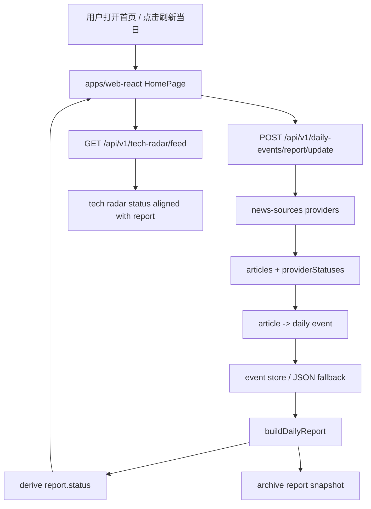

# Main Information Chain Refactor Design

日期：2026-06-15
类型：design
项目：auto-info
来源：用户确认 Phase 1「信息获取主链」重构
版式：结论先行，产品目标 -> 交互 -> 后端状态 -> 验收

## Summary

Phase 1 优先重构 Auto Info 的信息获取主链：来源健康 -> 事件入库 -> 今日日报 -> 科技雷达 -> 空态与错误态解释。目标不是做泛新闻站，而是为程序员身份的用户提供每日 AI/科技行业信息、投资相关政治金融信息，以及支撑这些工作的工具入口。

本阶段推荐方案是“主链闭环优先”：先让系统能解释“为什么没有事件”，再优化页面观感和底层抽象。首页手动刷新、定时刷新和科技雷达刷新必须共享可理解的来源状态语义。

## Product Positioning

Auto Info 是程序员自用的信息与决策工作台：

- 行业信息：AI、科技、模型、开源、平台、芯片、论文、产品发布。
- 投资信息：政治、金融、宏观、政策、地缘风险、市场变化，强调影响判断。
- 工具类：阅读助手、快捷访问、配置和后续资料沉淀，不抢首页主任务。

首页不是热点榜，也不是综合新闻墙。首页是每日情报控制台，首要回答：

1. 今天有没有值得关注的新信息？
2. 信息来自哪些来源，来源是否正常？
3. 为什么系统当前为空：未拉源、拉源失败、筛选为空，还是确实无新增？
4. 哪些信息进入 AI/科技与政治/金融判断链？

## Scope

### In Scope

- UC-001 今日日报主链：手动刷新默认拉源，报告返回来源状态与报告状态。
- UC-006 科技雷达主链：刷新状态与首页一致，空窗口展示可解释状态。
- 首页交互：展示来源健康、刷新状态、日报状态、事件时间线和来源证据。
- 后端状态语义：统一 `not_fetched`、`source_failed`、`filtered_empty`、`ready`。
- 测试：新增/调整特性测试覆盖“拉源失败不是无事件”“筛选为空要可解释”“手动刷新默认拉源”。

### Out of Scope

- 不做完整异步任务中心。
- 不迁移 MySQL 为唯一真实主存。
- 不重写所有页面视觉系统。
- 不大改阅读助手、分析页、快捷访问。
- 不为未来未确定功能提前抽复杂框架。

## UX Design

### Home

首页保持当前 Apple 风格与 `workspace-hero` / `DailyReportCard` 基础，但信息层级调整为：

1. 顶部状态：当前日期、日报事件数、上次刷新、下次刷新、来源状态。
2. 主操作：今日为「刷新当日」，默认触发外部信源拉取；历史为「回到今日」。
3. 概要：解释当前日报状态，禁止只显示“暂无事件”。
4. 时间线：保留「上次更新」锚点；若为空，锚点文案必须带原因。
5. 相关资料：展示本次实际拉到并入库的来源；拉源失败时展示 provider 状态。
6. 右侧栏：日期/归档/刷新记录，不重复报告正文。

### Empty And Error States

日报空态必须分为四类：

- `not_fetched`：当前日期尚未执行拉源更新，仅按本地库生成。
- `source_failed`：已尝试拉源，但全部 provider 失败或超时。
- `filtered_empty`：provider 有返回，但转换/筛选后没有当日有效事件。
- `ready`：存在当日事件，报告与来源证据可展示。

用户可见文案应直接说明下一步：

- `not_fetched`：点击「刷新当日」拉取最新来源。
- `source_failed`：查看 provider 状态，检查网络或配置。
- `filtered_empty`：展示已检索资料数量与筛选理由。
- `ready`：展示事件时间线与来源证据。

## Backend Design

### Source Refresh Boundary

UC-001 后端保留当前 `POST /report/update` 入口，但要求：

- `pullSources` 默认 `true`。
- 首页手动刷新不得传 `pullSources:false`。
- 响应中的 `sourceSearches[]` 必须足以推导报告状态。
- provider 状态不得只写日志，必须返回到前端。

### Report Status

`GET /report` 和 `POST /report/update` 的 `report` 均应包含：

```json
{
  "status": {
    "kind": "not_fetched | source_failed | filtered_empty | ready",
    "message": "可读解释",
    "sourceAttempted": true,
    "sourceArticleCount": 5,
    "ingestedEventCount": 0,
    "providerStatuses": []
  }
}
```

`GET /report` 是只读，不主动拉源。若当天没有归档或刷新记录，只能返回 `not_fetched`，不能暗示“世界没有事件”。

### Tech Radar Alignment

UC-006 的 `GET /feed` 复用同类刷新状态：

- `refreshCutoff` 仍展示上次更新时间。
- `todayWindow` 或等价字段带 `status.kind`。
- 当日科技条目为空时，说明是未拉源、拉源失败、筛选为空还是无科技条目。

## Data Flow



## Files Expected To Change

Spec:

- `spec/use-cases/UC-001-daily-major-events.md`
- `spec/use-cases/UC-006-ai-tech-radar.md`
- `spec/contracts/API-uc-001-daily-events.md`
- `spec/contracts/API-uc-006-tech-radar.md`

Backend:

- `services/api/src/use-cases/uc-001-daily-events/service.mjs`
- `services/api/src/use-cases/uc-001-daily-events/news-sources.mjs`
- `services/api/src/use-cases/uc-001-daily-events/daily-report-presentation.mjs`
- `services/api/src/use-cases/uc-006-tech-radar/service.mjs`
- optional shared helper: `services/api/src/shared/source-status.mjs`

Frontend:

- `apps/web-react/src/pages/HomePage.tsx`
- `apps/web-react/src/components/DailyReportTimeline.tsx`
- `apps/web-react/src/components/DailyReportCard.tsx`
- `apps/web-react/src/pages/TechRadarPage.tsx`
- optional shared view helper: `apps/web-react/src/lib/reportStatus.ts`

Tests:

- `scripts/test-features.mjs`
- `scripts/test-timeline-refresh.mjs`
- optional new focused script: `scripts/test-report-source-status.mjs`

## Acceptance Criteria

- 首页「刷新当日」默认拉取外部来源，不再只重建本地空库。
- 当日无事件时，页面能明确显示 `not_fetched` / `source_failed` / `filtered_empty` 中的一种原因。
- `POST /report/update` 返回 provider 状态、拉到的 article 数、入库 event 数和 report.status。
- `GET /report` 保持只读，不因为读取首页写入归档或拉取外部来源。
- 科技雷达与首页共享刷新节奏和空态语义。
- `npm run audit`、`npm run verify`、相关 feature/unit 测试通过。
- 双端 `4173` / `5174` 在线，首页关键 workflow 可手动验证。

## Risks

- 外部网络受沙箱或本机网络影响，测试需区分真实 provider 失败与本地沙箱失败。
- 过度抽象 source status 会拖慢 Phase 1；本阶段只抽可被 UC-001/UC-006 共用的最小模型。
- 旧归档缺少状态字段，读取时需兼容生成默认 `not_fetched` 或 `ready`。

## Design Self-Review

- Placeholder scan: 无未定项、空白项或延后实现项。
- Consistency: 产品目标、状态语义、API 和 UI 验收一致。
- Scope: 聚焦主链，不进入异步任务中心、MySQL 迁移或阅读助手大改。
- Ambiguity: 空态四分类已明确，GET/POST 写入边界已明确。
